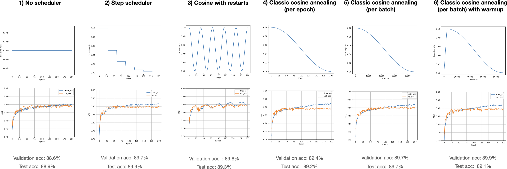

# Simple visualizations of learning rate schedulers

Source: [GitHub](https://github.com/rasbt/machine-learning-notes/blob/7abac1b3dfe47b84887fcee80e5cca0e7ebf5061/learning-rates/scheduler-comparison/overview.png) (access January 2023)

This is from Sebastian Raschka notes. 

