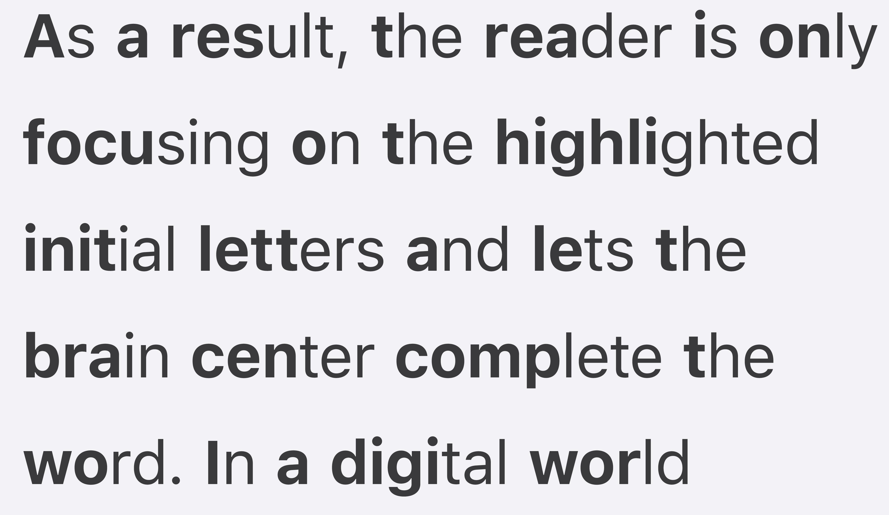

# Using Language Models to (probably) Read Faster

Source: [ahrm.github.io](https://ahrm.github.io/jekyll/update/2022/04/14/using-languge-models-to-read-faster.html) (access February 2024)

A couple of weeks ago I saw this hackernews article about a method of text rendering to increase text readability. The algorithm is pretty simple: highlight the first few characters of each word (how many characters depends on the size of the word).
Here is a screenshot of what it looks like from its website:

