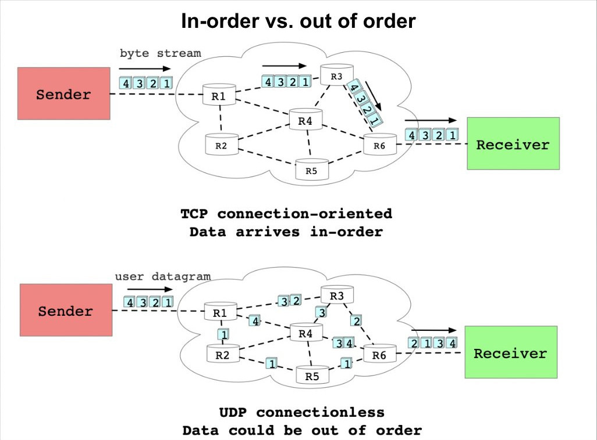
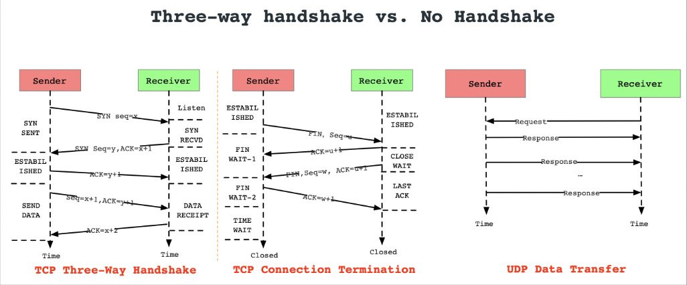
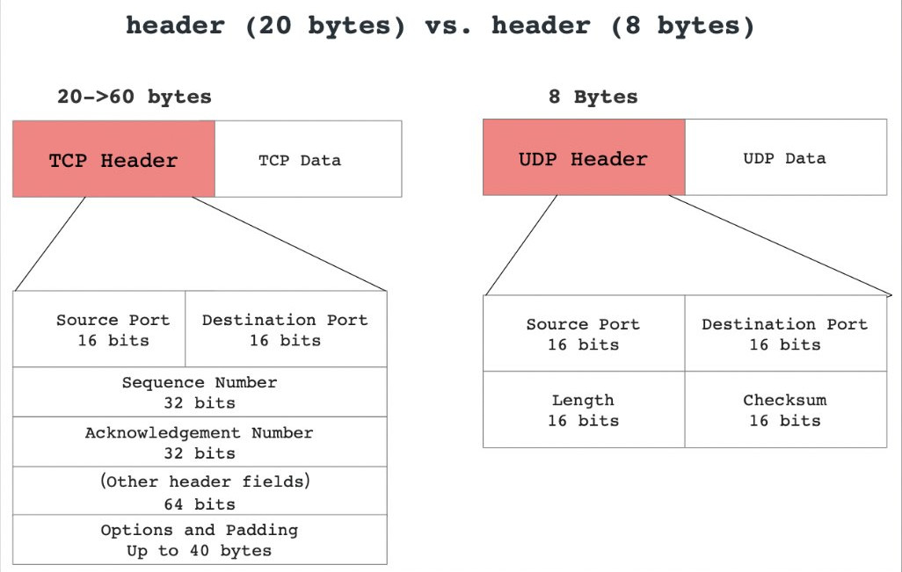
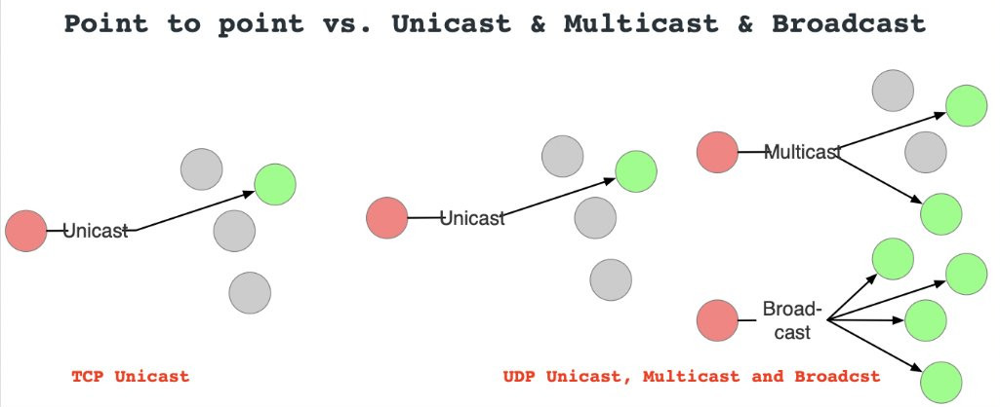
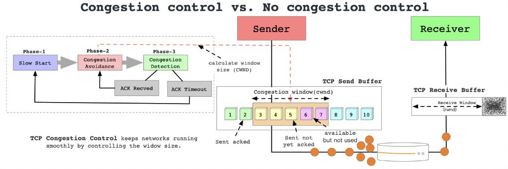
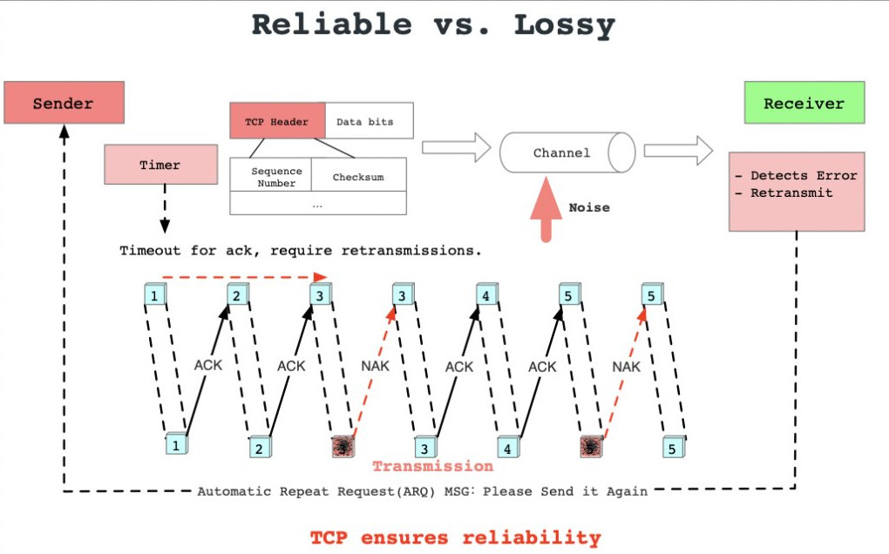
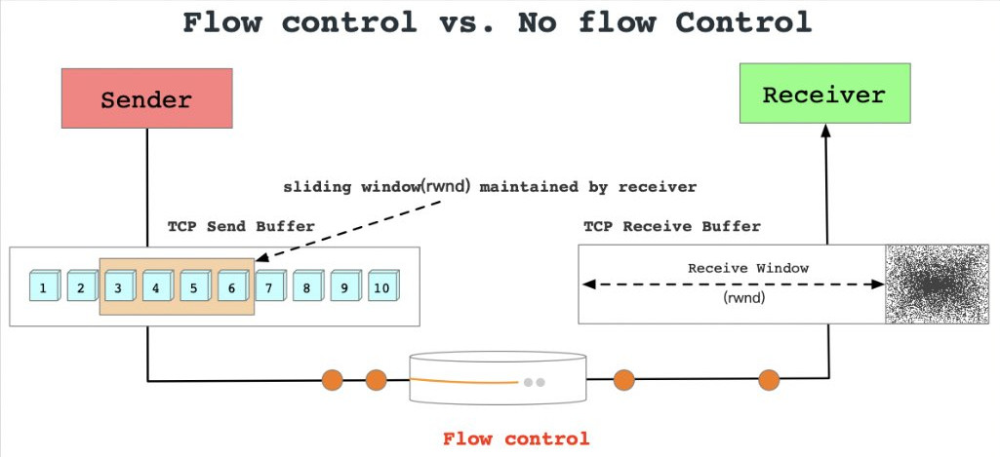
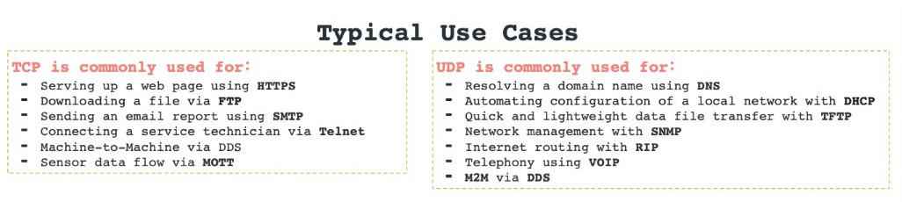
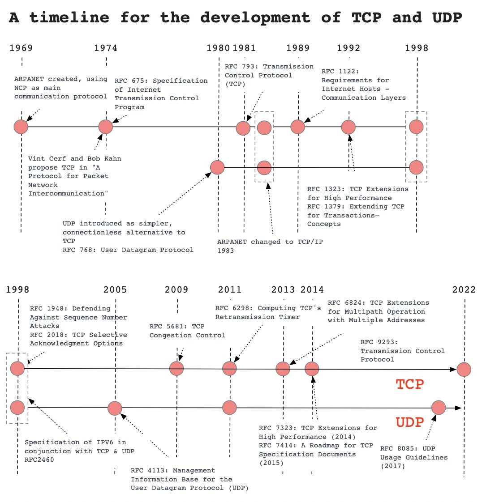

# TCP vs. UDP: 7 Differences You Should Know

Source: [twitter](https://twitter.com/alexxubyte/status/1643640904459386880) (access April 2023)

TCP vs. UDP: 7 Differences You Should Know:

1. Connection-oriented vs. connectionless
   - 
2. Three-way handshake vs. No handshake
   - 
3. Header size. Header (20 bytes) vs. (8 bytes)
   - 
4. Point-to-point vs. Unicast & Multicast & Broadcast
   - 
5. Congestion control vs. no congestion control
   - 
6. Reliable vs. lossy
   - 
7. Flow control vs. no flow control
   - 

## Typical use cases

## History

