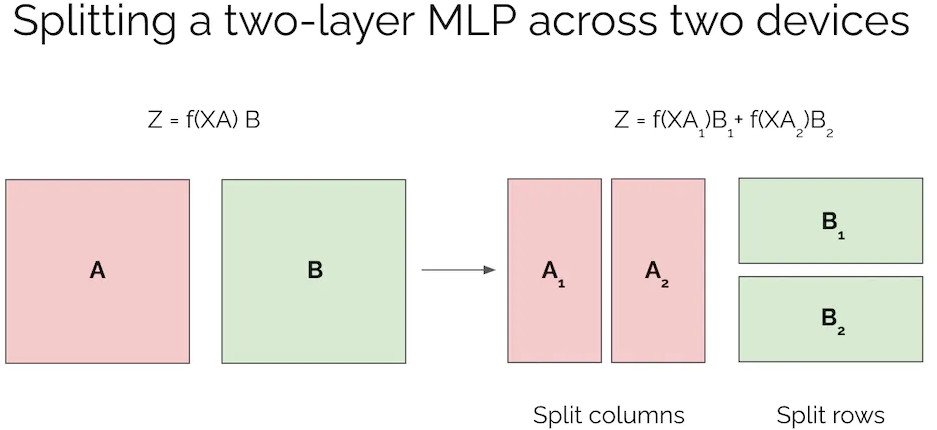

# Sharding Large Models with Tensor Parallelism

Source: [Misha Laskin blog](https://www.mishalaskin.com/posts/tensor_parallel) (access March 2023)

Article about tensor parallelism.

Let's consider a 2 layer MLP with layer 1 parameterized by matrix `A` and layer 2 parameterized by matrix `B`.
Now let's say we have a batch of data `X` and we want to compute the output `Z`. In a typical MLP,
we would compute `Y = f(XA)` and `Z = YB` where ff is the activation function. So how can we parallelize this model?

We can split matrix `A` into two equal parts **column-wise**, and matrix `B` into two equal parts **row-wise**.
